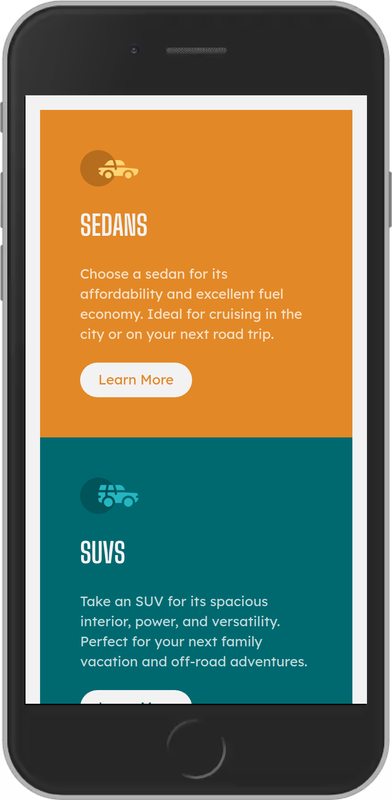

# Frontend Mentor - 3-column preview card component solution

This is a solution to the [3-column preview card component challenge on Frontend Mentor](https://www.frontendmentor.io/challenges/3column-preview-card-component-pH92eAR2-). Frontend Mentor challenges help you improve your coding skills by building realistic projects. 

## Table of contents

- [Frontend Mentor - 3-column preview card component solution](#frontend-mentor---3-column-preview-card-component-solution)
  - [Table of contents](#table-of-contents)
  - [Overview](#overview)
    - [The challenge](#the-challenge)
    - [Screenshot](#screenshot)
    - [Links](#links)
  - [My process](#my-process)
    - [Built with](#built-with)
    - [What I learned](#what-i-learned)

## Overview

### The challenge

Users should be able to:

- View the optimal layout depending on their device's screen size
- See hover states for interactive elements

### Screenshot

### Links

- [Solution on Frontend Mentor: ](https://www.frontendmentor.io/solutions/responsive-3column-card-component-using-flexbox-tailwindcss-webpack-zGDVB2YNJ)
- [Live site: ](https://mattdimicelli.github.io/3-column-preview-card-component/)

## My process

### Built with

- Semantic HTML5 markup
- Tailwind CSS
- Flexbox
- Mobile-first workflow
- Webpack

### What I learned

This was my second time ever using Tailwind CSS, so it was good practice.  I reinforced my knowledge of semantic HTML5, and I experienced the dilemma of "extracting" a custom class for repeated styles (such as the buttons) vs leaving them inline, which is part of the paradigm of Tailwind CSS.  I believe that I struck a useful balance.

